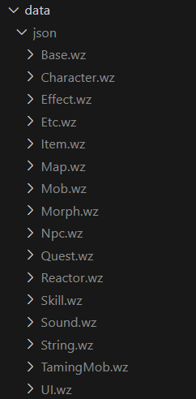

# react-MRLibrary

1. cd /my-react-app
1. npm install
1. npm run dev
1. access web at http://localhost:5173/

# to test API
1. npm install -g netlify-cli
1. netlify dev
1. access API at http://localhost:8888/api/v1

<hr>

### my notes:
1. Data files of ./data/data_xxxx.json are all output from :
    1. wz files -> batch xml with WZ-Explorer-Rebuild-master
    1. copy -> ./data as :
        
    1. run `node ./my-xml-parser/converter.js`, each parser function 
2. ./public/images/ are extracted using harepacker
    1. Character.wz -> ./public/images/characters  // weapon 01702786.img crashed when export， only Accessory, Cap, Cape, Coat, Glove, Longcoat, Pants, Ring, Shield, Shoes, Weapon
    1. Item.wz -> ./public/images/items
    1. Map.wz -> ./public/images/maps
    1. Mob.wz -> ./public/images/monsters
    1. Npc.wz -> ./public/images/npcs
    1. Skill.wz -> ./public/images/skills
    1. Map.wz -> ./public/images/worldmaps
    1. run `node ./my-harepacker-output-organizer/dumpFileCentralizer.js`, and copy the output to ./public/images
3. mp3 files are extracted using harepacker too, from Sound.wz, but i filtered out the short mp3, and uploaded it to separate [github repo](https://github.com/scotty66f/royals-ost/tree/refs/heads/main/audio) to save bandwidth
    1. run `node ./my-harepacker-output-organizer/generateMusicJson.js`, and copy the output to ./data

<hr>

<!-- next to update -->

## Log - July 27 2024
1. done - update exptable at lvl-163 
2. done - update typo of unonofficial to unofficial
3. done ... - make search for flexible instead of remember exact name e.g. search "snail green" instead of "green snail"
4. done - update game content to v92 
5. done -  mob exp sorting affected by NaN
6. done - change item stats UI from ```36 ~ 49```  to  ```36 ~ 44 or 49 ```

## Log - July 28 2024
1. done - add gacha info, location-name-type
2. done - add LHC gacha too, source from forum post
3. done - fix bug of wrong fallback to maplelegnds image, remove redundant .
png
4. done - added in Elemental-table Tab and its component utility. Undead/Holy/Fire/Ice/Lightning/Poison
5. done - fix bug of symbol shown at mob-map-location like &439 instead of "<"
6. done - highlight gacha item with high-value, whitescroll/chaos scroll/taru....
7. done - solved bug where monster spawn location of BOSS type mob not appears. Used data from data_Mob_MapOnly

## Log - July 30 2024
1. done - added in skill Tab and SkillInfo page
2. done - remove LHC gacha items from v87 update : https://royals.ms/forum/threads/lhc-exchange-rewards-cs-ws-bwg-taru-totem-rewards-found.193830/page-3#post-1446410
3. done - add skill into global search range


## Log - July 31 2024
1. done - revised USE tab search to include advanced search filter + DYNAMIC table with checkbox option
2. done -  fixed issue where earrings appear in Ring section
3. done -  Added Belt/Medal into equip search


## Log - Aug 2 2024
1. done - Add Union Search component & page, update pagination component to accept parameter into func
2. done - update pagination to have skip feature
3. done - notify user be redirected to maplelegends upon click of mob spawn map link
4. done - update 1 breadcrumb extra for weapon category e.g. /equip/bow/id=130000
5. done - add map_url from hiddenstreet. Crawling + Manual add in. 

## Log - Aug 4 2024
1. done - Add Quote/Today's Price table add HomePage. from api + googlespreadsheet

## Log - Aug 5 2024
1. done - Update LHC craftable items image.
2. done - Add in crafting recipe

## Log - Aug 6 2024
1. done - Minor update gacha item name and add in itemId.
2. done - Add Gacha tabs for gachable item in equipDetail and itemDetail
3. done - add Craft tabs for craftable item in equipDetail and itemDetail

## Log - Aug 7 2024
1. done - revise sort to let exact match in show in top search result.

## Log - Aug 8 2024
1. done - Add in NPC page, also added into global search.
2. done - Add in Quest and QuestDetail Page

## Log - Aug 31 2024
1. done - update library & gacha list to v92.1
2. done - Added miwok gacha 
3. done - fixed the sort by DESC bug, where NaN/No value id sort at front
4. done - add flexibility to search Quest by npc name 

## Log - Sep 30 2024
1. done - update library to v92.2 

## Log - Oct 23 2024
1. done - update library to v93

## Log - Nov 21 2024
1. done - update library to v93.1

## Log - Dec 01 2024
1. done - update library to v93.2

## Log - Dec 28 2024
1. done - update library to v93.3

## Log - Jan 29 2025
1. done - update library to v94

## Log - Feb 24 2025
1. done - fix Mob Sorting, ordered by "Level" 

## Log - Apr 12 2025
1. done - update library to v95, add shoulder accessory category

## Log - May 1 2025
1. done - add mastermind solver for GPQ aka sharenian pq

## Log - May 3 2025
1. done - update GPQ solver UI/UX, simplify and lesser userinput

## Log - May 4 2025
1. done - add : APQ / OPQ solver

## Log - May 8 2025
1. done - fea : add Questline search
2. done - fea : add column of orderBy stats at search result table
3. done - UI : add checkbox show cosmetic at equip page

## Log - May 9 2025
1. done - fix : add in images crawled from royals.wz

## Log - May 10 2025
1. done - fea : music library, .mp3 files stored at github

## Log - May 13 2025
1. done - fea : Map

## Log - May 14 2025
1. done - Add : Announcement from Royals crew

## Log - May 15 2025
1. done - Add : labelled Map , nonHD type

## Log - May 18 2025
1. done - add : search input now allow ID, itemId, mobId, skillId, etc....

## Log - May 19 2025
1. done - add : accuracy calculator, physical and magical(untested)

## Log - May 21 2025
1. done - UX : Equip page, auto select DESC order for some stats selection
2. done - add : filter by map region to Monster page / Elementable Table page
3. done - UX : Revamped Map page location filter

## Log - May 23 2025
1. done - Audio : can loop
2. done - fea : WorldMap Page

## Log - May 28 2025
1. done - fix : Accuracy_calc, with Region category add-in

## Log - May 31 2025
1. done - add : my-harerepacker-output-organizer folder
2. done - update library to v95.2

## Log - June 1 2025
1. done - fix & add : weapon category of Cash
2. done - UI : update text on opq/gpq solver
3. done - netlify : add Netlify Edge Functions for blocking AI bots crawler, to save bandwith

## Log - June 4 2025
1. done - UI : update logo & favicon

## Log - June 7 2025
1. done - API : add API v1 support & [documentation](https://royals-library.netlify.app/api/v1)

## Log - June 9 2025
1. done - update library to v95.3
2. done - Monster Page show a tab of mob stats

## Log - June 15 2025
1. done - update library to v95.3.1
2. done - fix : Map version issue with Rendered Map from github 

## Log - June 17 2025
1. done - Add : Real Time Map Renderer
2. done - fix : Map page where NPC inaccurate /mob error, UI of NPC use grid-auto

Next:
- show path from map to map with graph data stuctrue ?